## Pipeline обработки запросов

Рассмотрим на примере регистрации пользователя.
Приложение разбито логически на слои, и логика отработки данного эндпоинта происходит по цепочке:

`Client request -> Router -> Directives -> Json marshalling -> Validation -> Service -> Repository -> Convert ServiceResult to ApiResponse -> Response data to client`

Далее описываются все эти шаги подробно.

Клиент запрашивает ендпоинт для регистрации:

POST /api/v1/accounts

`{ "nick_name":"user123","email":"user123@gmail.com", "password": "asdf1234", "passwordRepeat": "asdf1234" }`

Akka http ранает нужный роутер:

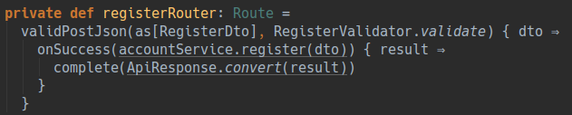

Здесь происходит следующее: 

Сначала мы вызваем метод `validPostJson`

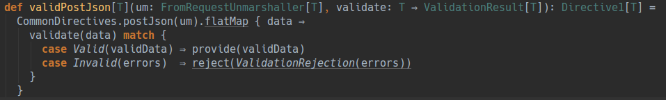

Рассмотрим метод подробно:

Он принимает унмаршаллер (нечто что позволит превратить нам данные от пользователя в объект указанного нами типа) и метод валидации.

Возвращает метод `validPostJson` директиву с объектом указанного нами типа в унмаршаллере.

В теле этого метода мы видим вызов еще одного метода из директив `postJsonDirective`:

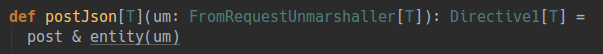

Эта директива как раз и проверяет пришел ли от пользователя HTTP POST запрос и извлекает из него нужный нам объект, при помощи тоо самого унмаршаллера.

Далее метод `validPostJson` этот извлеченный объект передает в метод валидации и проверяет валидные ли данные или нет.
Если данные валидные, то они пробрасываются через директиву, если же нет, то делается реджект `ValidationReject` с ошибками валидации. Реджект прекратит дальнейшую цепочку операций и прокинет ошибку выше, которую обработает специальный хэндлер и в данном случае венет клиенту ответ с ошибками валидации.

При вызове `validPostJson` мы передали в него `as[RegisterDto]` и `RegisterValidator.validate`

Сам RegisterDto - это просто класс для мапинга в него данных регистрации пришедших от пользователя:

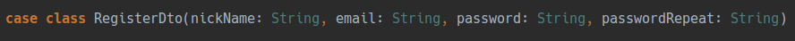

`as` - это метод в `akka-http` позволяющий извлечь из контекста нужный нам унмаршаллер, в данном случае это будет форматер для `RegisterDto` в/из `json`, который находится в `AccountJsonProtocol`:

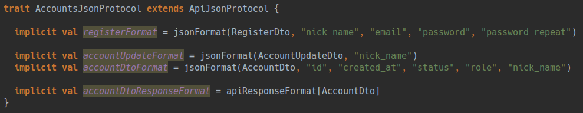

Рассмотрим 2ой парамет передаваймый нами в `validPostJson` - метод валидации:

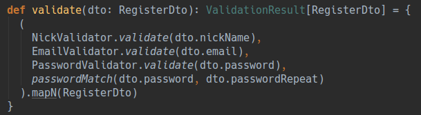

Метод принимает данные и валидирует их, в случае если с ними все нормально - просто возвращает тот же объект, если же есть ошибки, то вернет их.
Ошибки представляют собой список состоящий из поле в котором ошибся пользователь и информация об обишке, например: `"email" -> "неверный email"`

Резюмируя - при помощи метода `validPostJson` мы извлекли нужный нам объект, провалидировали его и прокинули данные назад в роутер, либо вернули ошибки валидации пользователю.

Теерь вернемся назад к нашему первоначальной точке - роутеру регистрации.
Далее мы видим, что полученные и провалидированные данные от пользователя, мы передаем в `accountService.register`.

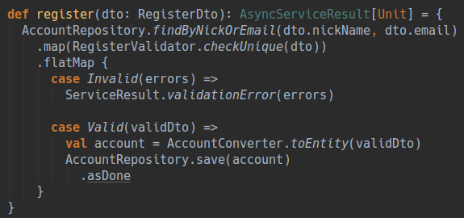

Этот метод принимает данные регистрации, производит саму логику регистрации и возвращает нам асинхронно результат отработки сервиса (`AsyncServiceResult`), который содержит либо информацию об успешном выполнении, либо ошибки произошедшие при регистрации.

В теле этого метода мы работу с `AccountRepository` - это слой где мы обращаемся к базе данных, в данном случае мы сначала ищем похожие аккаунты по нику и емэйлу, и в конце сохраняем новый аккаунт.

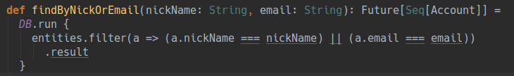

В репозиториях мы при помощи dsl'а похожего на простую работу с коллекциями работаем с даными в таблице смапленной на даный репозиторий. Таблица же мапается с нашим entity объектом (в данном случае с `Account`)

Объект аккаунта:

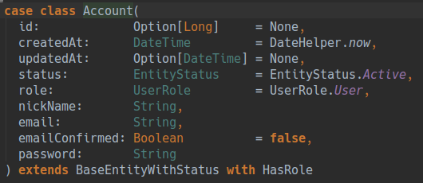

Таблица для маппинга на него:

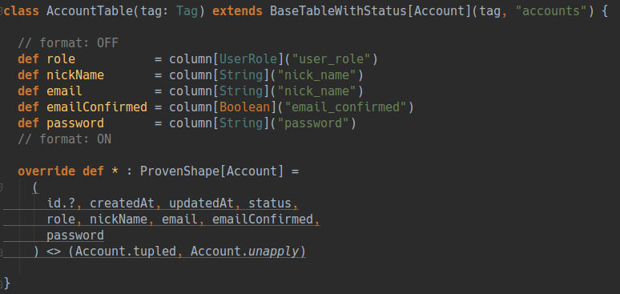

И само описание схемы хранения аккаунта в базе данных (в скрипте миграции):

Т.е. в репозитории происходит поиск/сохранение/обновление данных в БД и маппинг их в нужные нам объекты.

Вернемся `registerRouter` и к последнему этапу нашего pipeline - это возвращению ответа клиенту. 
Это происходит в методе `complete` - это специальный метод в `akka http`, который формирует ответ для клиента. Принимает он тоже унмаршаллер.

В данном случае мы передаем в него результат выполнения `ApiResponse.convert(result)` и сервер просто ответит телом со статусом.

Но в случае когда мы хотим вернуть пользователю тело с какими либо данными, произойдет следующая логика:

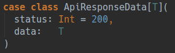

Это метод, который принимает как раз таки наш результат отработки сервис-слоя, метод конвертации объекта из сервис слоя (чаще всего `entity`) в `dto` объект и опять же тот самый `json formatter` из `AccountJsonProtocol`, который поможет нам превратить объект в готовый `json` для клиента.

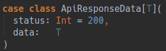

В итоге клиент получает ответ, вида:

`{ "status": 200 }`