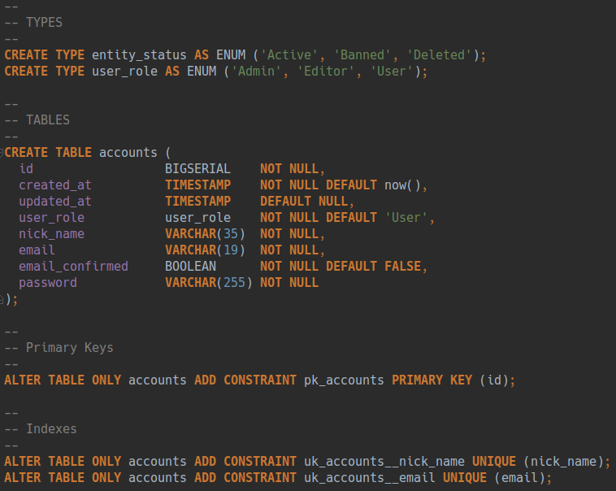

### Task description

#### Schema
Accounts: 

#### Example api responses:
- `{ "status": 200 }`
- `{ "status": 200, "data": {"role":"Admin","nick_name":"ExampleUser","id":1,"status":"Active","created_at":1510936306853} }`
- `{ "status":409,"error": {"details":{"email":"invalid","nick_name":"empty"}} }`

#### Endpoints

- Account register:

 request: `POST "/api/v1/accounts" { "nick_name": String, "email": String, "password": String, "password_repeat": String }`
 
 response: `{ "status": Int }`
 
- Account update (need auth):

 request: `POST "/api/v1/accounts/{id}" { "nick_name": String }`
 
 response: `{ "status": Int }`
 
- Account get:
 
 request: `GET "/api/v1/accounts/{id}"`
  
 response `{ "status": 200, "data": {"role":"Admin","nick_name":"ExampleUser","id":1,"status":"Active","created_at":1510936306853} }`
  
- Auth:

 request: `POST "/api/v1/auth" { "login": String, "password": String }`
 
 response: `{ "status": 200, "data": { "role": UserRole, "token": String, "created_at": Timestamp, "expiry_at": Timestamp } }`
 
 description: `login` is `nickName`
 
 how use token: in http header `Authorization -> Bearer {token}`
 

#### Additions
 
 need schema migration, configs, validation